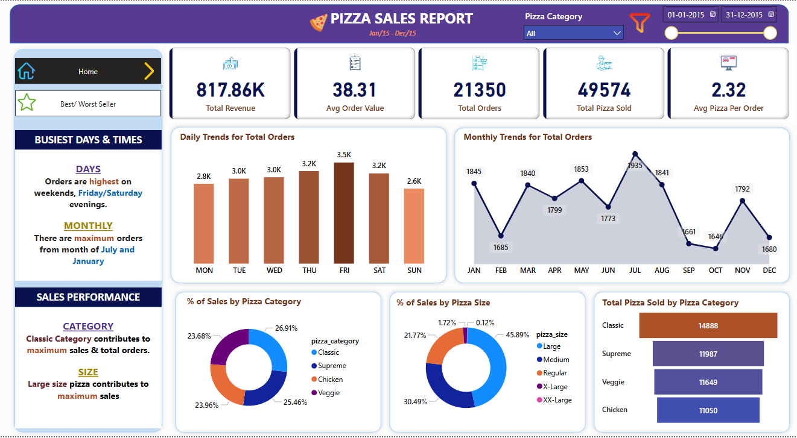
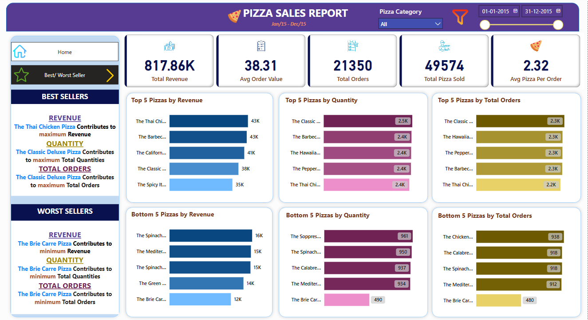

# Pizza-Sales-Analysis
**(Using Excel, SQL,POWERBI)**

A data analysis project focused on uncovering key insights from a pizza sales dataset. The goal is to identify patterns in customer behavior, top-selling pizzas, peak sales times, and provide actionable business recommendations.

## 📊 Project Overview

This project analyzes historica sales data(over 48k+ rows) from a pizza store to answer KPIs And business questions such as:

**KPIs:**
- Total Revenue
- Average Order Value
- Total Pizzas Sold
- Total Orders
- Average Pizzas Per Order

**Business Questions:**
- Daily Trend for Total Orders
- Monthly Trend for Orders
- % of Sales by Pizza Category
- % of Sales by Pizza Size
- Best 5 Pizzas by all parameters
- Worst 5 Pizzas by all parameters

## 🛠️ Tools & Technologies Used

- **Excel** – Data cleaning and transformation
- **SQL(MS SQL SERVER)** – Finding KPIs And Required Insights
- **POWER BI** – For Data visualization And interactive dashboards

## 📸 Dashboards

### 📅 Home Dashboard (Sales Summary)

### 🔥 Best & Worst Seller Dashboard

## 🔍 Key Insights

- **Top-selling pizza:** The Thai Chicken Pizza
- **Worst-selling pizza:** The Brie Carre Pizza
- **Peak order time:** Fridays and Saturdays Eveninigs
- **Best month for sales:** July And January
- **Most popular category:** Classic pizzas

## 💡 Business Recommendations

- Stock up on top-selling pizzas before weekends
- Offer promotions on weekdays to boost sales
- Consider seasonal offers during peak months
